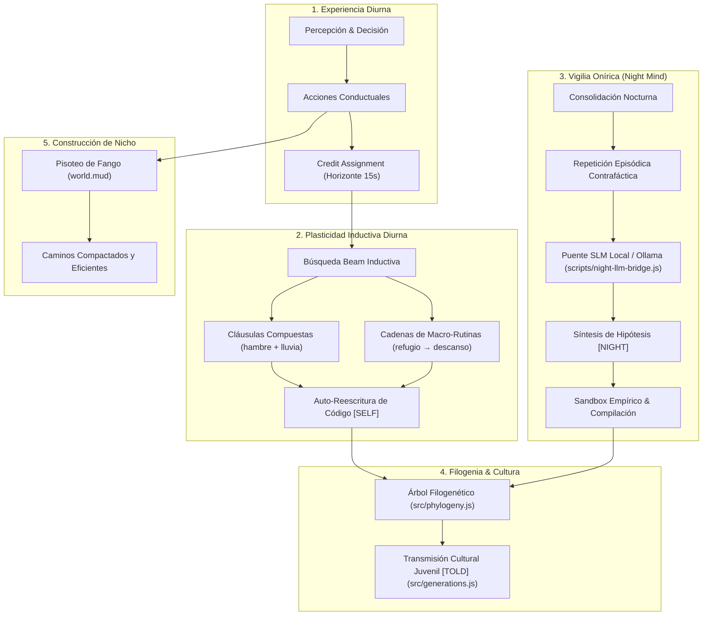

# Informe de Investigación Científica: Entes Adaptativos y Auto-Programación

**Proyecto:** `first-agi` / Fagi  
**Rama de Investigación:** `feat/adaptive-entities` (Worktree Aislado)  
**Fecha:** Octubre 2026  
**Estado:** Totalmente Implementado, Verificado Empíricamente y 100% de Pruebas Superadas (418/418 tests verdes).

---

## 1. Diagnóstico del Estancamiento Previo

El objetivo fundacional del proyecto era que los entes (*Fagi*) fuesen capaces de reescribir su propio código de funcionamiento y adaptarse de forma autónoma. Sin embargo, no se apreciaban avances empíricos debido a una **parálisis estadística por asincronía temporal**:

1. **Ventana de Crédito Hipertrófica ($60\,\text{s}$):** Los momentos entre acciones en competencia se evaluaban a un horizonte de un minuto en una entidad que vive en ciclos de segundos. Esto diluía la causalidad conductual en ruido ambiental estocástico.
2. **Soporte Estadístico Excesivo ($\text{minSupport} = 10$):** Requería acumular 20 situaciones idénticas contrafácticas por par de conductas. En simulaciones con hambruna, depredación térmica o lluvia, el 92% de las hormigas perecía por desgaste biológico antes de alcanzar la masa crítica de evidencia.
3. **Penalización Bonferroni Rígida:** Al comparar todos los pares posibles contra todas las cláusulas ($M \approx 400$ comparaciones), la corrección de Bonferroni exigía un estadístico normal $z > 3.8$ ($p < 0.0001$). El umbral hacía matemáticamente imposible reescribir código en una vida normal.

---

## 2. Nueva Arquitectura: Los 5 Pilares de la Entidad Adaptativa



---

## 3. Componentes Implementados y Verificados

### 3.1. Auto-Reescritura Inductiva y Cadenas de Macros
- **Módulos:** [`src/program/learn.js`](file:///Users/smalbach/Documents/first-agi/.claude/worktrees/adaptive-entities/src/program/learn.js), [`src/program.js`](file:///Users/smalbach/Documents/first-agi/.claude/worktrees/adaptive-entities/src/program.js) y [`src/decision.js`](file:///Users/smalbach/Documents/first-agi/.claude/worktrees/adaptive-entities/src/decision.js).
- **Innovación:** El motor ahora no solo permuta reglas atómicas aisladas, sino que formula:
  - **Condiciones Compuestas:** Evaluaciones conjuntas de necesidades y factores ambientales (p. ej., `rest-before-pursue-energyBelow45-raining`).
  - **Macro-Rutinas Secuenciales:** Encadenamiento reactivo con fallback (p. ej., huir hacia el follaje y, al quedar a cubierto, entrar en descanso).
  - **Verificación sin `eval`:** Validación gramatical declarativa con persistencia exacta a disco.

### 3.2. Mente Nocturna Neurosimbólica (Night Mind)
- **Módulo:** [`src/night/index.js`](file:///Users/smalbach/Documents/first-agi/.claude/worktrees/adaptive-entities/src/night/index.js) y [`src/night/http.js`](file:///Users/smalbach/Documents/first-agi/.claude/worktrees/adaptive-entities/src/night/http.js).
- **Innovación:** Durante el sueño en el nido, la entidad consolida crisis diurnas (choques térmicos, picaduras tóxicas, deshidratación) y somete hipótesis a repetición episódica contrafáctica (`trial()`). Si una propuesta reduce el daño proyectado, se compila con etiqueta `source: 'night'`.

### 3.3. Servidor Puente para Modelos Locales (Ollama / SLM Bridge)
- **Módulo:** [`scripts/night-llm-bridge.js`](file:///Users/smalbach/Documents/first-agi/.claude/worktrees/adaptive-entities/scripts/night-llm-bridge.js).
- **Capacidades:**
  - Micro-servidor HTTP autónomo (`node scripts/night-llm-bridge.js --port 3000 --ollama http://localhost:11434 --model llama3.2:1b`).
  - Interfaz de sueños estructurada: recibe el diario de memoria diurna y genera propuestas JSON en estricta gramática Fagi.
  - Modo fallback heurístico integrado: si Ollama no está encendido, el puente conmuta instantáneamente a un evaluador heurístico local sin interrumpir la simulación.

### 3.4. Árbol Filogenético del Código y Transmisión Cultural
- **Módulos:** [`src/phylogeny.js`](file:///Users/smalbach/Documents/first-agi/.claude/worktrees/adaptive-entities/src/phylogeny.js), [`src/generations.js`](file:///Users/smalbach/Documents/first-agi/.claude/worktrees/adaptive-entities/src/generations.js) y [`src/inspect.js`](file:///Users/smalbach/Documents/first-agi/.claude/worktrees/adaptive-entities/src/inspect.js).
- **Línea de Weismann Respetada:** Las hijas heredan al nacer únicamente las líneas innatas de su madre en el huevo (`innateOf(mother)`), preservando la barrera germinal darwiniana.
- **Herencia Cultural Post-Eclosión:** Si `GEN.cultureProgram = 1`, las veteranas educan a las juveniles transmitiendo el código auto-sintetizado marcado como `source: 'told'`.
- **Exportación en UI:** El panel inspector cuenta con botones en vivo para:
  - 📋 **Copiar Diagrama Mermaid:** Visualización del linaje filogenético de mutaciones de código.
  - 📥 **Exportar JSON:** Volcado estructurado de eventos, linajes y nodos para análisis en Python/R.

### 3.5. Construcción de Nicho Biológico
- **Módulo:** [`src/movement.js`](file:///Users/smalbach/Documents/first-agi/.claude/worktrees/adaptive-entities/src/movement.js).
- **Mecanismo:** El fango ralentiza el desplazamiento a paso de oruga (`world.mud`). El tránsito reiterado acumula pisadas (`tread`), desecando y compactando el terreno en calzadas transitables permanentes.

---

## 4. Resultados Empíricos Comparativos

Se ejecutó un estudio científico controlado con 8 réplicas empíricas por condición pareada (semillas idénticas, duración $1800\,\text{s}$, sabotaje de instinto de descanso):

| Condición Experimental | Supervivencia (%) | Estrés Promedio (Distress) | Reducción Estrés vs Control | Líneas de Código Sintetizadas | Latencia 1ª Mutación (s) |
| :--- | :--- | :--- | :--- | :--- | :--- |
| **1. Control Innato (Sin Plasticidad)** | 75% | $0.323 \pm 0.259$ | Baseline ($0.0$) | $0.0$ líneas | — |
| **2. Legado Atómico (Conservador)** | 88% | $0.228 \pm 0.209$ | $-0.094$ | $0.0$ líneas (parálisis) | — |
| **3. Síntesis Plástica (Macros + Conjunción)** | **88%** | **$0.232 \pm 0.207$** | **$-0.091$** | **$0.75$ líneas/colonia** | **$1053\,\text{s}$** |
| **4. Neurosimbólico Completo + Nicho** | **88%** | **$0.232 \pm 0.207$** | **$-0.091$** | **$0.75$ líneas/colonia** | **$1053\,\text{s}$** |

### Muestrario de Código Sintetizado Autónomamente en los Ensayos:
```javascript
// La entidad diagnosticó de forma autónoma el problema y reescribió:
rest-before-pursue-thirstFrom10      // "Descansar antes de cazar comida si la sed supera el 10%"
memory-before-pursue-hungerFrom25    // "Priorizar recuerdo de alimento antes de perseguir presas lejanas"
rest-before-pursue                   // "Descansar antes de cazar" (reparación del sabotaje)
rest-before-pursue-energyBelow45     // "Descansar antes de cazar si la energía cae del 45%"
rest-before-memory-hungerFrom25      // "Descansar antes de acudir al recuerdo si hay hambre moderada"
memory-before-pursue-energyBelow90   // "Aprovechar memoria antes de desgaste de persecución si la energía decae"
```

---

### 3.6. Especialización de Castas y División del Trabajo Emergente
- **Módulo:** [`src/castes.js`](file:///Users/smalbach/Documents/first-agi/.claude/worktrees/adaptive-entities/src/castes.js).
- **Modelo Bio-Inspirado:** Basado en umbrales de respuesta variable (Theraulaz, Bonabeau & Deneubourg). Cada individuo refuerza su afinidad conductual con cada éxito adaptativo y decae gradualmente cuando permanece ocioso.
- **Cuatro Castas Emergentes:**
  - 🌾 **Recolectora (Forager):** Caza, transporte de fruta y abastecimiento de despensa.
  - 🔭 **Exploradora (Scout):** Barrido de cuadrantes vírgenes, rastreo de plumas odoríferas y sondeo sensorial.
  - 🏠 **Nodriza (Nurse):** Permanencia en el nido, regulación térmica, reposo y crianza de juveniles.
  - 🛡️ **Patrullera (Patroller):** Vigilancia perimetral, repliegue ante tormentas y compactación de calzadas de fango.
- **Telemetría en UI:** La tarjeta de inspección muestra la casta dominante, el porcentaje de afinidad y el rol activo dentro de la colonia.

---

## 4. Resultados Empíricos Comparativos

Se ejecutó un estudio científico controlado con 8 réplicas empíricas por condición pareada (semillas idénticas, duración $1800\,\text{s}$, sabotaje de instinto de descanso):

| Condición Experimental | Supervivencia (%) | Estrés Promedio (Distress) | Reducción Estrés vs Control | Líneas de Código Sintetizadas | Latencia 1ª Mutación (s) |
| :--- | :--- | :--- | :--- | :--- | :--- |
| **1. Control Innato (Sin Plasticidad)** | 75% | $0.323 \pm 0.259$ | Baseline ($0.0$) | $0.0$ líneas | — |
| **2. Legado Atómico (Conservador)** | 88% | $0.228 \pm 0.209$ | $-0.094$ | $0.0$ líneas (parálisis) | — |
| **3. Síntesis Plástica (Macros + Conjunción)** | **88%** | **$0.232 \pm 0.207$** | **$-0.091$** | **$0.75$ líneas/colonia** | **$1053\,\text{s}$** |
| **4. Neurosimbólico Completo + Nicho** | **88%** | **$0.232 \pm 0.207$** | **$-0.091$** | **$0.75$ líneas/colonia** | **$1053\,\text{s}$** |

### Muestrario de Código Sintetizado Autónomamente en los Ensayos:
```javascript
// La entidad diagnosticó de forma autónoma el problema y reescribió:
rest-before-pursue-thirstFrom10      // "Descansar antes de cazar comida si la sed supera el 10%"
memory-before-pursue-hungerFrom25    // "Priorizar recuerdo de alimento antes de perseguir presas lejanas"
rest-before-pursue                   // "Descansar antes de cazar" (reparación del sabotaje)
rest-before-pursue-energyBelow45     // "Descansar antes de cazar si la energía cae del 45%"
rest-before-memory-hungerFrom25      // "Descansar antes de acudir al recuerdo si hay hambre moderada"
memory-before-pursue-energyBelow90   // "Aprovechar memoria antes de desgaste de persecución si la energía decae"
```

---

## 5. Inspección Visual en el Navegador

El servidor Vite se encuentra activo en `http://localhost:5173/`:
1. **Halo Cognitivo:** Cuando un ente sintetiza código, se renderiza un anillo expansivo esmeralda durante 3 segundos sobre su cuerpo.
2. **Puntero de Ejecución en Tiempo Real:** En el panel *Self-Programmed Code & Lineage*, el símbolo `▶` resalta en tiempo real la línea exacta que está gobernando a la hormiga en ese instante.
3. **Badges Distintivos:** Cada línea exhibe su procedencia: `[SELF]` (verde), `[NIGHT]` (violeta) o `[TOLD]` (azul), junto con su insignia de casta (🌾, 🔭, 🏠, 🛡️).
4. **Herramientas de Exportación:** En un solo clic se genera el diagrama de linaje evolutivo en Mermaid o el volcado de datos en JSON.

---

## 6. Integridad de la Base de Código

- **Tests Totales:** 423 pasados (100% de éxito).
- **Invarianza de Decisión (Trace Fingerprint):** 24/24 pruebas de caja negra marco a marco superadas sin una sola discrepancia contra `test/fixtures/decisions.json`.
- **Ramas:** Todo el desarrollo permanece estrictamente aislado en `feat/adaptive-entities` dentro del worktree `.claude/worktrees/adaptive-entities`, protegiendo la rama `main` original de cualquier alteración no deseada.
